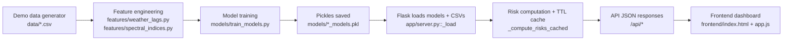

# AquaRisk — AI Early-Warning for Lake & Public-Health Risk

**Hackathon (Round 1):** Codecure - AI Hackathon (SPIRIT'26, IIT (BHU) Varanasi)  
https://unstop.com/hackathons/codecure-ai-hackathon-spirit26-iit-bhu-1624607

**One-line pitch:** AquaRisk answers **“Which lake is risky right now, why, and what should we do next?”** by fusing bloom, disease, groundwater, drainage and sewage signals into an operational risk score.

**Run locally:** http://127.0.0.1:5000

---

## Contents

- [Overview](#overview)
- [Tech Stack & Tools](#tech-stack--tools)
- [Features](#features)
- [Installation / Setup](#installation--setup)
- [Technical Workflow](#technical-workflow)
- [API (Main Endpoints)](#api-main-endpoints)
- [Project Structure](#project-structure)
- [Demo Checklist (3 minutes)](#demo-checklist-3-minutes)
- [Disclaimer](#disclaimer)

<details>
<summary><b>Demo assets (optional)</b></summary>

- Demo video: _add link_
- Slides / pitch deck: _add link_
- Team: _add names + roles_

</details>

## Overview

Water-related risks show up as multiple weak signals before they become a crisis. AquaRisk provides a single, explainable view that helps teams prioritize field action.

---

## Tech Stack & Tools

- **Backend:** Flask (serves API + static frontend)
- **ML:** LightGBM, scikit-learn
- **Data:** pandas, numpy
- **Visuals:** Leaflet, Chart.js, Plotly
- **Optional dashboards:** Streamlit + Folium
- **Optional integrations:** Gemini (server-side proxy), Telegram digest

---

## Features

- India map with lake-level risk overview
- Lake detail view with **multi-signal** scores (bloom, disease, groundwater, drainage, sewage)
- **15-day outlook** (8 days history + 7 days projection) via timeline API
- Explainability endpoint (top model feature importances)
- Drainage + sewage alert lists for quick triage
- Confidence + data freshness indicators (derived from available sources)

---

## Installation / Setup

### Quickstart (Windows PowerShell)

```powershell
cd aquarisk

py -3 -m venv .venv
\.\.venv\Scripts\python -m pip install -U pip
\.\.venv\Scripts\python -m pip install -r requirements.txt

# Starts Flask API and serves frontend from /frontend
\.\.venv\Scripts\python app\server.py
```

Open:

- UI: http://127.0.0.1:5000/
- Health: http://127.0.0.1:5000/api/health

Note: Python 3.11+ is recommended for best compatibility with ML wheels.

<details>
<summary><b>Optional: run the Streamlit dashboard</b></summary>

```powershell
\.\.venv\Scripts\python -m streamlit run app\streamlit_app.py
```

</details>

---

## Technical Workflow

### End-to-end pipeline



### Runtime behavior (important for judges)

- **First run:** if CSVs or model pickles are missing, the backend generates demo data and trains models automatically.
- **Serving:** Flask serves the static UI (HTML/JS/CSS) and provides JSON APIs.
- **Scoring:** risk scores are computed from the latest row per lake, cached for ~30 seconds to avoid repeated scoring during dashboard refresh.
- **Outlook:** `/api/timeline/<lake_id>` returns a compact 15-day series (past/today/future) for charts.

---

## API (Main Endpoints)

- Core
  - `GET /api/health`
  - `GET /api/lakes`
  - `GET /api/timeline/<lake_id>` (includes `outlook`)
  - `GET /api/summary`
  - `GET /api/weekly_summary`
  - `GET /api/features`
  - `GET /api/alerts` (drainage)
- Sewage
  - `GET /api/sewage`
  - `GET /api/sewage/alerts`
  - `GET /api/sewage/timeline/<lake_id>`
- Optional integrations
  - `POST /api/ai` (requires `GEMINI_API_KEY`)
  - Telegram: `/api/telegram/*` (requires `TELEGRAM_BOT_TOKEN`)

<details>
<summary><b>Optional configuration (env vars)</b></summary>

```powershell
$env:GEMINI_API_KEY = "YOUR_KEY_HERE"         # enables POST /api/ai
$env:TELEGRAM_BOT_TOKEN = "YOUR_TOKEN_HERE"   # enables Telegram digest + subscribe endpoints
```

</details>

---

## Project Structure

```text
aquarisk/
  app/
    server.py              # Flask API + serves /frontend
    streamlit_app.py       # Optional Streamlit dashboard
  data/                    # Demo CSVs + lake metadata
  features/                # Feature engineering utilities
  models/                  # Training + saved model pickles
  frontend/                # HTML/JS/CSS dashboard UI
  requirements.txt
```

---

## Demo Checklist (3 minutes)

<details>
<summary><b>Suggested flow</b></summary>

1) Open the map → click a lake (risk overview)
2) Show the multi-signal cards + confidence/freshness
3) Open timeline → highlight the 15-day outlook
4) Open drainage/sewage alerts for triage

</details>

---

## Disclaimer

Hackathon prototype. Default data is demo/synthetic; outputs need real-world validation before operational use.
